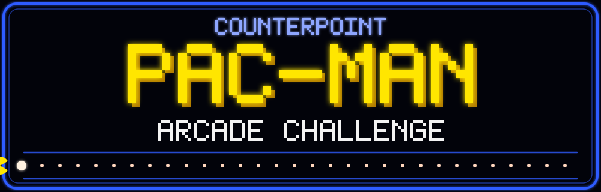
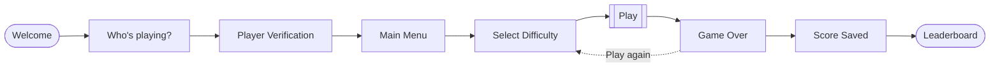
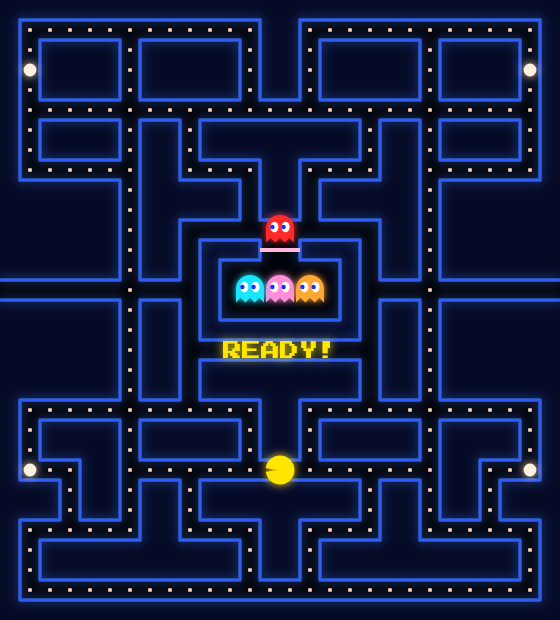
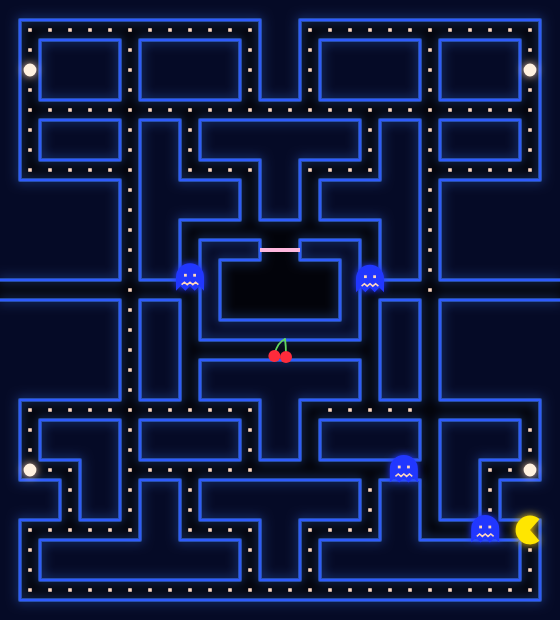
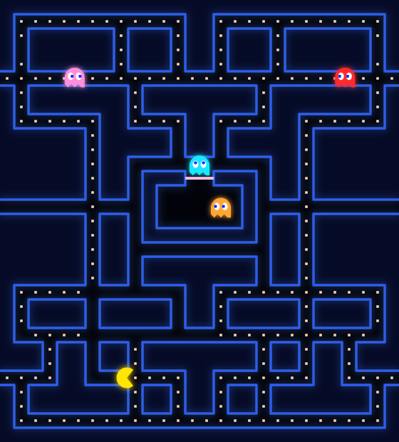
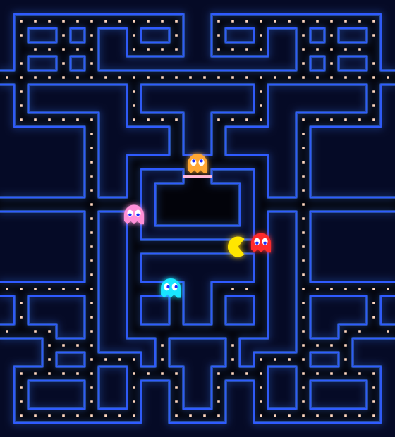
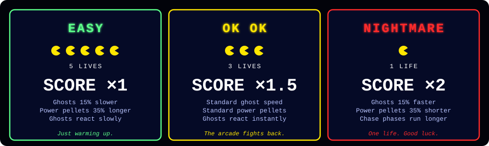
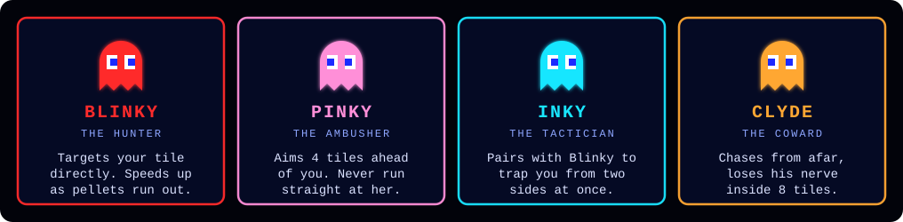
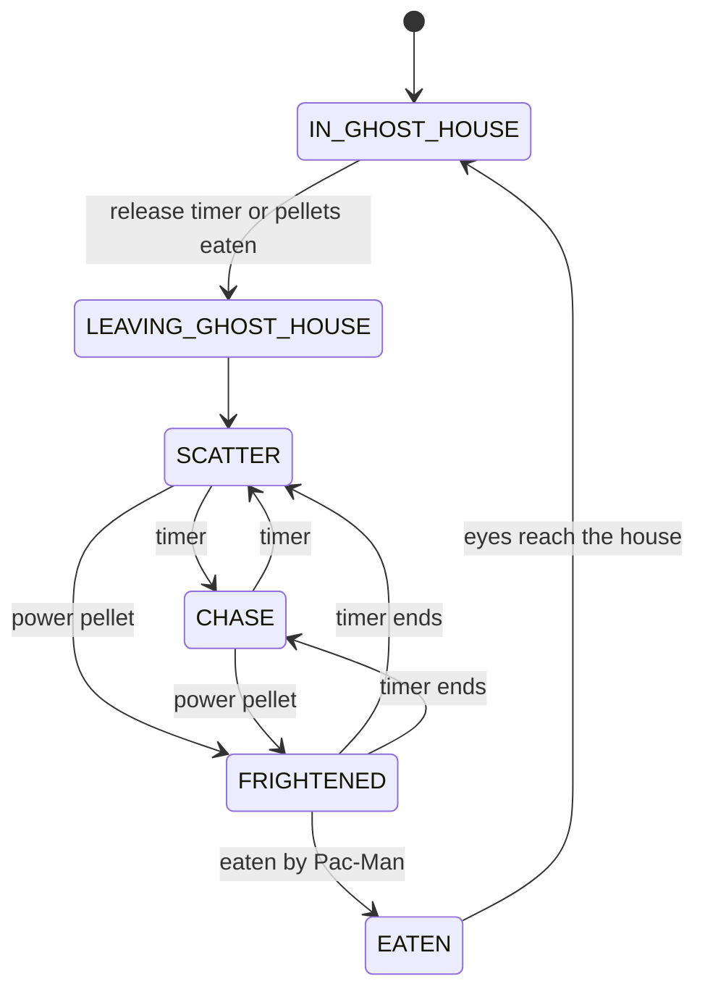
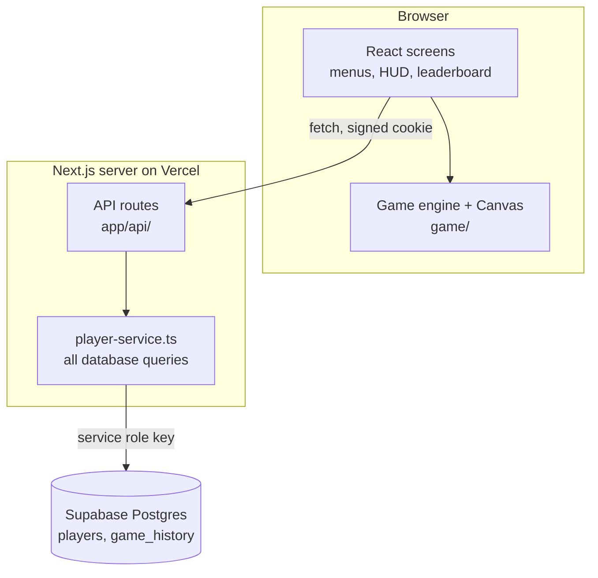

<div align="center">



<br>

**Eat the pellets. Dodge the ghosts. Climb the company leaderboard.**

A complete Pac-Man arcade built for internal Counterpoint use: real HTML5 Canvas gameplay, four ghost personalities, 10 designed levels that roll into endless mode, three difficulty modes, and a leaderboard your whole team can chase.

<br>


[Features](#features) ·
[Screenshots](#screenshots) ·
[Quick start](#quick-start) ·
[Setup guide](#setup-guide) ·
[How to play](#how-to-play) ·
[Ghost AI](#ghost-ai) ·
[Under the hood](#under-the-hood) ·
[Troubleshooting](#troubleshooting)

</div>

---

## Overview

Employees are **pre-loaded into a database table**. There is no sign-up, no login and no third-party auth of any kind. A player picks their name, confirms a short **Player Code**, chooses a difficulty and plays. When the game ends, the score is checked and saved on the server.



## Features

| | |
| --- | --- |
| 🎮 **A real Pac-Man engine** | Canvas rendering with `requestAnimationFrame`, delta-time movement (same speed at 60, 120 or 144 Hz), buffered turns, tunnel wraparound. |
| 👻 **Four distinct ghosts** | Blinky, Pinky, Inky and Clyde each use their own classic targeting rule, plus a full ghost state machine. |
| 🧩 **10 designed mazes, then endless** | Ten hand-tuned levels, then the mazes rotate forever with difficulty scaling that is clamped so it never becomes impossible. |
| 🔥 **Three difficulty modes** | EASY, OK OK and NIGHTMARE change lives, ghost behaviour and how much every point is worth. |
| 🏆 **Company leaderboard** | Overall, per-difficulty and Highest Level views, your row highlighted, and a "YOUR RANK" line if you're outside the top 25. |
| 🔐 **No accounts** | Pre-seeded employees, Player Code verification, signed httpOnly session cookie. Supabase is used only as a Postgres database. |
| 🛡️ **Server-side score checks** | Scores come from game state, never a text box. The server validates every submission and ignores any player ID sent by the browser. |
| 🔊 **Arcade sound and polish** | WebAudio tones (no audio files), an intro jingle, pause menu with confirmations, "NEW HIGH SCORE" celebration, a CRT scanline glow. |

## Screenshots

<table>
  <tr>
    <td align="center" width="25%"><br><sub><b>LEVEL 1 · CLASSIC</b><br>Ready to start</sub></td>
    <td align="center" width="25%"><br><sub><b>POWER PELLET</b><br>Frightened ghosts and fruit</sub></td>
    <td align="center" width="25%"><br><sub><b>LEVEL 4 · TUNNEL RUN</b><br>Extra tunnels</sub></td>
    <td align="center" width="25%"><br><sub><b>LEVEL 10 · COUNTERPOINT</b><br>The final exam</sub></td>
  </tr>
</table>

<sub>Board frames drawn by the game's own Canvas renderer. Drop real screenshots of the menus and leaderboard into `docs/screenshots/` once it's running to show off the full arcade.</sub>

## Quick start

```bash
npm install
cp .env.example .env.local     # fill in the three values (see "Environment variables")
npm run dev                    # http://localhost:3000
```

Before that works you need a Supabase project with the tables created. That takes about five minutes; the [Setup guide](#setup-guide) walks through it.

| Step | What to do |
| :---: | --- |
| **1** | Create a Supabase project and copy its URL and `service_role` key. |
| **2** | Run `supabase/schema.sql`, then `supabase/seed.sql` (three demo players). |
| **3** | Fill in `.env.local` and run `npm run dev`. |
| **4** | Pick **Demo Player 1**, enter code `1111`, choose a difficulty and play. |
| **5** | Delete the demo players and add your real employees before sharing the link. |

---

## Setup guide

### Supabase setup

1. Create a project at [supabase.com](https://supabase.com).
2. Open **Project Settings → API** and copy:
   - the **Project URL** → `SUPABASE_URL`
   - the **`service_role`** key → `SUPABASE_SERVICE_ROLE_KEY`
3. Do **not** put either value anywhere that starts with `NEXT_PUBLIC_`. They must stay on the server.

> Supabase Auth is **not used**. The browser never talks to Supabase; only the Next.js server does, with the service role key.

### Create the database tables

Open the Supabase **SQL Editor** and run these in order:

1. [`supabase/schema.sql`](supabase/schema.sql) creates `players` and `game_history`, adds indexes, and locks both tables down with Row Level Security.
2. [`supabase/seed.sql`](supabase/seed.sql) (optional) adds three demo players so you can try the arcade straight away:

| Player | Player Code | Department |
| --- | :---: | --- |
| Demo Player 1 | `1111` | Online Systems |
| Demo Player 2 | `2222` | Finance |
| Demo Player 3 | `3333` | Operations |

**Delete the demo players before real use.**

### Environment variables

Copy `.env.example` to `.env.local` and fill in:

| Variable | Purpose |
| --- | --- |
| `SUPABASE_URL` | Your Supabase project URL. Server only. |
| `SUPABASE_SERVICE_ROLE_KEY` | Service role key. Server only. Never expose it. |
| `PLAYER_SESSION_SECRET` | A long random string you generate yourself. It signs the cookie that says which player is verified. |

Generate the secret with either of these, then paste the output after the `=` (no quotes):

```bash
openssl rand -base64 48
# or, if openssl isn't installed:
node -e "console.log(require('crypto').randomBytes(48).toString('base64'))"
```

> If you keep the placeholder text from `.env.example`, the app still runs, but anyone who has seen the example file knows your secret and could forge a session cookie. If the secret is missing or shorter than 16 characters, the server refuses to start. Changing it later just signs everyone out.

<details>
<summary><b>How to add employees</b></summary>

<br>

Employees are rows in the `players` table. Add them in the Supabase **SQL Editor** or **Table Editor**:

```sql
insert into public.players (employee_number, name, player_code, department) values
  (101, 'Ava Thompson',  '4821', 'Finance'),
  (102, 'Ben Carter',    '7390', 'Operations'),
  (103, 'Chloe Nguyen',  '2265', 'Online Systems')
on conflict (employee_number) do nothing;
```

| Column | Notes |
| --- | --- |
| `employee_number` | Unique. Use your real employee ID. |
| `name` | Shown in the player list and leaderboard. |
| `player_code` | Short code the employee types to confirm it's them. |
| `department` | Optional. Shown on the leaderboard and searchable in the player list. |

Remove the demo players: `delete from public.players where employee_number in (1, 2, 3);`
Change someone's code: `update public.players set player_code = '5555' where employee_number = 101;`

Score, level and stats columns are managed by the game. Don't set them by hand.

</details>

### How Player Codes work

The Player Code is a **lightweight identity confirmation**. It stops a colleague from accidentally (or playfully) posting a score under your name. It is deliberately not a login system, and the UI calls it **PLAYER VERIFICATION**.

- **Checked on the server only**, in constant time (`timingSafeEqual` over SHA-256 digests). It is never sent to the browser: `/api/players` returns just `id`, `name` and `department`.
- **Nothing is revealed on failure.** A wrong code, an unknown player and a malformed request all show the same message.
- **Rate limited.** After 8 wrong attempts in 5 minutes (per IP and player) further attempts are refused. The limiter lives in memory, so it is best-effort per serverless instance.
- **Signed cookie.** On success the server sets an httpOnly cookie holding only the verified player's ID (12 hours). `POST /api/game/complete` reads the player from that cookie and **ignores any `playerId` in the request body**.
- **Keep expectations realistic.** Codes are short and stored as plain text so an admin can look them up. Treat this as a friendly guard rail, not a security boundary, and don't reuse real passwords or PINs as Player Codes.

### Local development

Requires Node.js 20+.

| Command | What it does |
| --- | --- |
| `npm run dev` | Start the dev server on `http://localhost:3000`. |
| `npm run typecheck` | TypeScript check. |
| `npm run test:engine` | Headless engine test: random-input fuzzing on all difficulties, endless progression through level 13, the ghost eaten → house → re-release cycle, score multipliers and scaling clamps. |
| `npm test` | Typecheck + engine test. |
| `npm run generate:mazes` | Regenerate `game/maze-layouts.ts` (validated: fully connected, no dead ends, no open 2×2 blocks). |
| `npm run build` / `npm start` | Production build and server. |

### Deploy to Vercel

1. Push the project to a Git repository.
2. In Vercel choose **Add New → Project** and import it. The Next.js preset is detected automatically.
3. Under **Environment Variables**, add `SUPABASE_URL`, `SUPABASE_SERVICE_ROLE_KEY` and `PLAYER_SESSION_SECRET` for Production (and Preview if you use it).
4. Click **Deploy**.
5. Open the URL, pick a demo player and play one game. Then check the `game_history` table in Supabase to confirm the score saved.

> To limit the arcade to employees, use Vercel deployment protection or your company's SSO or network rules at the hosting layer. The app itself has no auth by design.

---

## How to play

### Controls

| Key | Action |
| :---: | --- |
| <kbd>↑</kbd> <kbd>←</kbd> <kbd>↓</kbd> <kbd>→</kbd> or <kbd>W</kbd> <kbd>A</kbd> <kbd>S</kbd> <kbd>D</kbd> | Move (a turn pressed slightly early is buffered) |
| <kbd>P</kbd> or <kbd>Esc</kbd> | Pause / resume |
| <kbd>M</kbd> | Mute / unmute (remembered) |
| <kbd>1</kbd> <kbd>2</kbd> <kbd>3</kbd> | Pick a difficulty on the selection screen |

The game pauses by itself when the browser tab is hidden. The pause menu offers **Resume**, **Restart Level**, **Restart Game** and **Quit to Menu**, and asks before anything destructive.

### Difficulty modes

<div align="center">

</div>

<br>

Harder modes pay more. The multiplier applies to **everything** you score (pellets, ghosts and fruit), so the number on screen is exactly what gets saved.

| Award | EASY ×1 | OK OK ×1.5 | NIGHTMARE ×2 |
| --- | :---: | :---: | :---: |
| Pellet | 10 | 15 | 20 |
| Power pellet | 50 | 75 | 100 |
| Ghosts (per power pellet) | 200 · 400 · 800 · 1600 | 300 · 600 · 1200 · 2400 | 400 · 800 · 1600 · 3200 |
| Fruit | 100 – 5000 | 150 – 7500 | 200 – 10000 |

<details>
<summary><b>Every difficulty setting</b> (<code>game/difficulty.ts</code>)</summary>

<br>

| Field | EASY | OK OK | NIGHTMARE | Meaning |
| --- | :---: | :---: | :---: | --- |
| `lives` | 5 | 3 | 1 | Lives at the start of a game. |
| `scoreMultiplier` | 1 | 1.5 | 2 | Multiplies every score award. |
| `ghostSpeedMultiplier` | 0.85 | 1 | 1.15 | Scales ghost speed. |
| `frightenedMultiplier` | 1.35 | 1 | 0.65 | How long ghosts stay frightened after a power pellet. |
| `aggressionMultiplier` | 0.8 | 1 | 1.25 | Longer chase and shorter scatter phases; Clyde gets braver. |
| `ghostReleaseMultiplier` | 1.3 | 1 | 0.75 | How long ghosts wait in the house. |
| `progressionMultiplier` | 0.6 | 1 | 1.25 | How strongly the level table's ramp is felt. |
| `reactionMs` | 400 | 0 | 0 | Ghosts only "see" Pac-Man's position this often. |

`resolveParams(level, difficulty)` combines the level table with these settings and clamps every result, so nothing can become impossible.

</details>

### Levels

Levels 1 to 10 are a hand-tuned table in [`game/levels.ts`](game/levels.ts). Each level has its own maze, speeds, power-pellet time, scatter and chase timing, ghost-house release speed and fruit.

| Level | Maze | Ghost speed | Power pellet | Fruit |
| :---: | --- | :---: | :---: | :---: |
| 1 | CLASSIC | 90% | 7.0 s | 🍒 Cherry |
| 2 | CORNER CUT | 94% | 6.0 s | 🍓 Strawberry |
| 3 | CROSSROADS | 95% | 5.5 s | 🍊 Orange |
| 4 | TUNNEL RUN | 96% | 5.0 s | 🍊 Orange |
| 5 | THE GRID | 99% | 4.5 s | 🍎 Apple |
| 6 | SPLIT DECISION | 100% | 3.0 s | 🍎 Apple |
| 7 | LABYRINTH | 103% | 2.6 s | 🍈 Melon |
| 8 | OVERDRIVE | 110% | 2.2 s | 🍈 Melon |
| 9 | GAUNTLET | 108% | 1.4 s | 🚀 Galaxian |
| 10 | COUNTERPOINT | 110% | 1.2 s | 🚀 Galaxian |

<sub>Ghost speed is relative to Pac-Man's base speed and shown for OK OK; the other modes scale it. Two fruits appear per level (after 30% and 70% of the pellets are eaten) and vanish after about 9.5 seconds.</sub>

**There is no final level.** From level 11 the mazes rotate (`mazeId = (level − 1) % 10`) and the numbers keep scaling from level 10. Every value is clamped by `LEVEL_LIMITS` (frightened time never drops below 1 second, and normal ghost speed never exceeds 115% of Pac-Man's base speed before Blinky's Cruise Elroy boost), so endless mode gets harder without becoming impossible. Fruit climbs to 🔔 Bell (3000) on levels 11-12 and 🗝️ Key (5000) from level 13.

---

## Ghost AI

<div align="center">

</div>

<br>

All ghost logic lives in [`game/ghost-ai.ts`](game/ghost-ai.ts) and [`game/engine.ts`](game/engine.ts). At every intersection a ghost picks the legal direction whose next tile is closest to its target, and it never reverses on its own. Only the target differs:

| Ghost | Target while chasing |
| --- | --- |
| **Blinky** (red) | Pac-Man's tile. Speeds up ("Cruise Elroy") as pellets run out. |
| **Pinky** (pink) | 4 tiles ahead of Pac-Man, an ambush. |
| **Inky** (cyan) | Take the tile 2 ahead of Pac-Man, then double the vector from Blinky through it. |
| **Clyde** (orange) | Pac-Man's tile until within about 8 tiles, then his own corner. |



- **SCATTER and CHASE** alternate on a timer, and ghosts reverse direction at each switch, as in the original. The timer pauses while ghosts are frightened.
- **FRIGHTENED** ghosts wander at random, more slowly, and flash before they recover.
- **EATEN** ghosts return to the house as eyes, regenerate, then leave again.
- Ghosts leave the house **one at a time**, on a timer or after enough pellets are eaten, scaled by difficulty. They also **slow down in tunnels**.

---

## Under the hood

### Architecture



React owns the menus, HUD and save flow. The engine owns everything that changes 60 times a second, and reports back only when something the HUD shows actually changes.

<details>
<summary><b>Project structure</b></summary>

<br>

```
app/                  Next.js routes: page, layout, theme, api/
  api/                players · player/verify · player/me · player/logout · session · leaderboard · game/complete
components/arcade/    Menus and screens: intro, player selector, main menu, difficulty, leaderboard, how to play
components/game/      Canvas host, HUD, pause menu, game over, game orchestrator
game/                 Headless engine: maze, movement, ghosts, AI, levels, difficulty, scoring, sound, renderer
lib/                  Server + shared code: Supabase client, session cookie, player-service, rate limit, types
scripts/              Maze generator and headless engine test
supabase/             schema.sql and seed.sql
docs/                 README graphics and screenshots
```

All database queries live in `lib/player-service.ts`. Nothing else touches Supabase.

</details>

### Security and anti-cheat

- **No score-entry UI exists.** Scores come only from the game engine's own state at game over.
- **Every submission is checked** on the server: integer ranges for score, level, pellets, ghosts and duration; difficulty must be one of the three names; and the score must be plausible for the reported pellets, ghosts and level (using that difficulty's multiplier).
- **Saves are idempotent.** Each game carries a unique `client_game_id`, so pressing **TRY AGAIN** after a network error can never save the same game twice.
- **Personal bests only go up.** A lower score never overwrites a higher one.
- **The browser can't reach the database.** Row Level Security blocks the public key entirely, and only the server holds the service role key.

> This is a friendly-competition guard rail. A determined developer with browser tools could still craft a believable-looking request, so it is not tamper-proof.

---

## Troubleshooting

<details>
<summary><b>"The arcade server is not configured yet."</b></summary>

<br>

One of the three environment variables is missing, or `PLAYER_SESSION_SECRET` is shorter than 16 characters.

</details>

<details>
<summary><b>"The arcade database is unavailable."</b></summary>

<br>

Check `SUPABASE_URL` and the service role key, and confirm you ran `schema.sql`. The server logs show the underlying error.

</details>

<details>
<summary><b>The player list is empty</b></summary>

<br>

Run `seed.sql`, or add employees (see "How to add employees").

</details>

<details>
<summary><b>No sound, or no intro jingle</b></summary>

<br>

Browsers block audio until you click or press a key. If the intro jingle can't play on its own, the intro shows "CLICK OR PRESS A KEY FOR SOUND"; the first click enables audio and replays the intro with the jingle. Also check the mute state (<kbd>M</kbd>).

</details>

<details>
<summary><b>The screen says to use a desktop or laptop</b></summary>

<br>

Below 640 px wide the arcade asks you to switch to a larger screen.

</details>

---

<div align="center">

<sub>Built for the Counterpoint team. Insert coin to continue.</sub>

</div>
